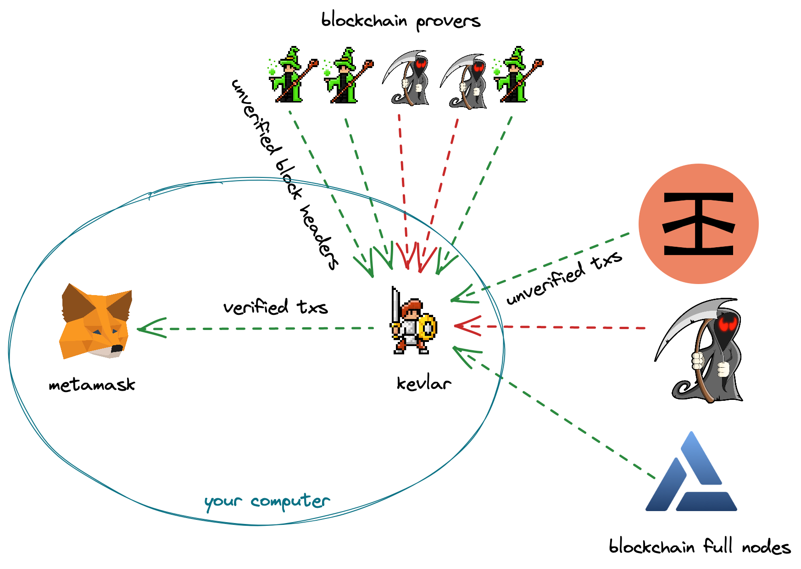

# Kevlar

[](https://discord.gg/ePV3prSPGW)


Kevlar is a CLI tool to run a light client-based RPC Proxy for PoS Ethereum. Kevlar can be used to make your Metamask or any RPC-based wallet completely trustless! Kevlar first syncs to the latest header of the beacon chain and then starts an RPC server. This local RPC server can be added to MetaMask or any other RPC-based wallet. Every RPC call made by the wallet is now verified using Merkle Inclusion proofs to the latest block header. Currently Kevlar supports two kinds of sync methods: the **Light Sync** based on the light client sync protocol specified by the Ethereum Specification and the **Optimistic Sync** (which is 100x faster than Light Sync) based on construction from the research paper [Proofs of Proof of Stake in Sublinear Complexity](https://arxiv.org/abs/2209.08673).

### Start the RPC Proxy

```bash
npm i -g @lightclients/kevlar
kevlar
```

The PRC is now available at `http://localhost:8546`. Add this local network to metamask.

```bash
kevlar --help
Options:
      --help        Show help                                          [boolean]
      --version     Show version number                                [boolean]
  -n, --network     chain id to start the proxy on (1, 5)        [choices: 1, 5]
  -c, --client      type of the client          [choices: "light", "optimistic"]
  -o, --provers     comma separated prover urls
  -u, --rpc         rpc url to proxy
  -p, --port        port to start the proxy                             [number]
  -a, --beacon-api  beacon chain api URL
```

### Build Locally

Clone the repo and perform the following commands

```bash
yarn install
yarn build
```

### Run Server

```bash
cp .env.example .env
yarn start
```

### Deploy Server to heroku

```bash
bash src/provers/light-optimistic/deploy-heroku.sh <heroku-app-name>
```

### Deploy to Docker

```bash
docker run -p 8546:8546 --name kevlar shresthagrawal/kevlar
curl -X POST --header "Content-type: application/json" --data '{"jsonrpc":"2.0","method":"eth_blockNumber","params":[],"id":1}' http://localhost:8546/
```
